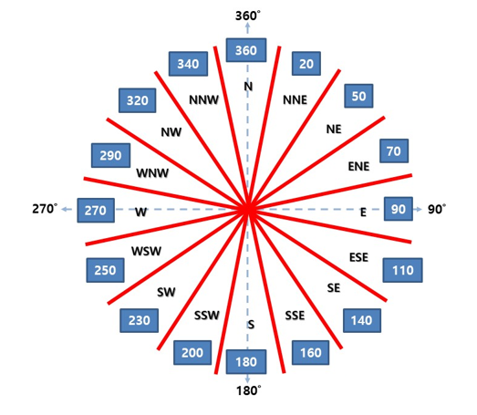

# **PM10_Analysis**

## **3학년 B반 201844045 김연욱**
## **주제 : 미세먼지 분석**
- 미세먼지 데이터 : KOSIS 국가통계포털 csv파일 ([바로가기](https://kosis.kr/statHtml/statHtml.do?orgId=106&tblId=DT_106N_03_0200076&vw_cd=MT_ZTITLE&list_id=T_7&seqNo=&lang_mode=ko&language=kor&obj_var_id=&itm_id=&conn_path=MT_ZTITLE))

- 날씨 데이터 : 공공데이터포털 Open API ([바로가기](https://www.data.go.kr/data/15059093/openapi.do))

### **참고 사항**
- 미세먼지 데이터는 2010년 ~ 2020년 데이터 사용
- 날씨 데이터는 2010년 ~ 2020년 데이터 사용
- 미세먼지 데이터를 측정한 지역(구분(2))을 기준으로 날씨 데이터 가져옴
- 세종시는 2012년 7월 1일에 17번째로 광역자치단체가 되어 그 이후 데이터의 부재가 있음
- 최다풍향의 16방위   
